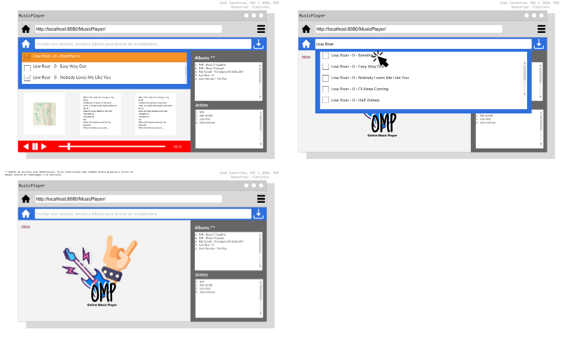

# POO Project

## Objetivo:

* Hacer un reproductor MP3 en el navegador Web usando etiquetas de audio HTML5 que permita cargar la librería de música detectada en un directorio específico del servidor, mostrar la letra de la canción que se escucha leyendo API’s/HTML’s en la Web, cargando una imagen del arte del álbum desde el folder de canciones en el disco duro y permitiendo descargar canciones desde el sitio web.

* Cada equipo centralizará su desarrollo en la POO, el AOO, el DOO, el uso de la Web, el uso de la Web para multimedia, la programación orientada a objetos en la Web, la consulta de servicios o páginas Web desde su aplicación, la Web compatible con múltiples navegadores y el manejo dinámico de archivos que se encuentran en el disco duro. Su proyecto será probado en un navegador Desktop y en un navegador Móvil.
Su Mp3 Player en la Web leerá dinámicamente  las canciones desde el disco duro. 
* Todas la canciones que se encuentren en el directorio Library o en alguno de sus subdirectorios se debe mostrar como una canción en la aplicación Web. Debe existir un buscador de texto con el cual pueda buscar canciones por nombre, álbum o artista usando un único campo de texto en la parte superior de la pantalla principal. 
* Cuando se escuche una canción, el arte asociado con el álbum se debe mostrar en pantalla (la imagen del arte debe encontrarse en la Librería de canciones).

* Al escuchar una canción, su aplicación de forma dinámica y asíncrona deberá buscar la letra de dicha canción y mostrarla en la pantalla. La aplicación mostrará dos versiones de la letra, una usando un API de lyrics en internet (el cual debe ser investigado por el estudiante), y la segunda versión usando un HTML site del cual el sistema descargará la letra y la parseará para mostrarla en pantalla. Su aplicación deberá mostrar secciones de “Cargando” cada vez que haga una petición y la información aún no está disponible para mostrarse. La consulta del API y del HTML site deben hacerse desde los controladores Java.

* Usando sesiones, la interfaz deberá permitir seleccionar una o muchas canciones de diferentes artistas y deberá permitir al usuario descargar dichas canciones mediante un ZIP. La generación del ZIP debe hacerse mediante sub-procesos hacia un programa Python en Linux.
* El audio debe poder reproducirse en la página web haciendo uso de la etiqueta nativa de audio de HTML5.

## Requerimientos y restricciones:

* No se acepta el uso de librerías, frameworks o código adicional de terceros que no se mencionan en esta especificación, y se espera que su proyecto sea programado completamente por usted y su equipo de trabajo. No se aceptará plagio ni desconocimiento del código en ningún escenario. Existirá una entrevista donde se consultará a individuos del equipo sobre el funcionamiento del proyecto.

* Toda operación (agregar, buscar, quitar, procesar, etc) se debe realizar usando paradigma orientado a objetos.
Debe ser funcional en Linux Ubuntu 16.04 con Eclipse 4.14, en Java Server Pages mediante Tomcat usando HTML, CSS, Javascript y Java, aplicando las metodologías, nomenclaturas y técnicas enseñadas en clase.
* El sistema debe tener un aspecto visual superior al del segundo parcial. Vea las imágenes de referencia del proyecto para obtener una idea.
* Debe tener evidencia en fotografías del análisis, diseño y programación orientada a objetos de toda la aplicación (diagramas, lluvia de ideas, relación 1 a muchos, entidades, descripción de comportamiento de objetos, características de los objetos, consideraciones, bocetos, maquetas, entre otros). Cada acción (seleccionar, descargar, reproducir, siguiente, etc) corresponde con una acción orientada a objetos. Estas evidencias deben ser imágenes png, jpg o archivos PDFs de calidad razonable.
* Documentación interna en el código mediante comentarios de múltiples líneas en cada función, clase o algoritmo mediante JavaDoc.
* En su codificación debe usar POO en el backend y en el frontend, usando al 100% las nomenclaturas y técnicas usadas en clase.
* Puede usar Jquery en su proyecto para la función exclusiva de AJAX.
* Para comprimir debe usar Python3 ZipFile.
* Su programa Web debería ejecutar el programa de Python en la ruta /eclipse/jee-2019-12/eclipse/Python/. 

## Objetivo Secundario:

* Promover la investigación de componentes visuales usando programación orientada a objetos y programación web.
* Integrar temáticas de clase y aplicarlas mediante el proyecto de investigación.
* Promover el trabajo colaborativo entre miembros del mismo equipo para alcanzar una meta en común.

## Pantalla Principal:

* Toda la funcionalidad del sistema debe ocurrir en una misma página index.jsp usando múltiples pantallas modales y componentes flotantes dentro del sitio, usando múltiples controladores según MCV, aplicando AJAX, usando API’s e implementando sesiones.
* Muestra una pantalla la cual permite ver “el arte principal del sistema” junto con un botón/enlace para los créditos (nombres, números de cuenta de los autores junto con el nombre de la clase, sección, periodo académico, año y catedrático), en una sección un campo de búsqueda de canciones, en una sección una lista de los artistas detectados en su aplicación, y en otra sección una lista de los álbumes detectados en su aplicación.
* Cada vez que se cargue esta pantalla principal, debe ser calculada y actualizada toda la información de la misma (i.e.: detectar las nuevas canciones, nuevos álbumes, recordar las canciones a descargar).
* Las búsquedas deben hacerse mediante Ajax y mostrar los resultados mediante una lista en una sección de la pantalla usando componentes flotantes.
* Al reproducir una canción, se deberán mostrar: **nombre de artista, título de la canción, título del álbum, arte del álbum, dos secciones con la letra de la canción y un botón para “cerrar” la canción** y volver al estado anterior antes de reproducir la misma. 
* Los controles a mostrar en cada canción deben ser: **la barra de progreso, reproducir la canción anterior, reproducir la canción siguiente, detener o reproducir la canción, y silenciar la canción mientras se sigue escuchando (volumen en mute)**. 
* Los programadores del proyecto elegirán si usar los botones nativos de la etiqueta audio o si desarrollar sus controles propios y específicos o hacer una mezcla de ambos.
* Cuando el usuario navega en las canciones, cada canción debe tener un “checkbox” de tal forma que el usuario pueda seleccionar 1 o muchas canciones, aunque esta selección se haga en diferentes búsquedas, y dicha selección de canciones debe aparecer en alguna sección de la pantalla (usando componentes flotantes o pantallas modales) de tal forma que el usuario pueda presionar un botón descargar para descargar un archivo ZIP con las canciones seleccionadas.
* Cuando el usuario quiera buscar una canción, álbum o artista, al terminar de escribir dicho texto el sistema deberá comenzar a hacer la búsqueda en el sistema para mostrar los resultados en pantalla.

## Operaciones Externas:

* El sistema debe obtener las letras de las canciones en tiempo real desde dos sitios diferentes:
* Desde un Web API de lyrics cualquiera, que funcione en JSON o en XML. Este sitio de lyrics es un API GET o un WebService externo a su sistema y no es desarrollado por el alumno. Este sitio debe ser de uso gratuito.
* Desde un Web Site de Lyrics en HTML que muestra la letra de la canción, donde el sistema deberá extraer desde el HTML la letra de la canción mediante técnicas de parseo. Este sitio de lyrics es externo a su sistema y no es desarrollado por el alumno. Este sitio debe ser de uso gratuito.

## Operaciones en Disco:

* Dentro de un directorio en el servidor web (ubicado en la carpeta de eclipse/jee-2019-12/eclipse/Library), el sistema deberá leer todos los sub-directorios y todos los archivos de imagen y de audio para listar los mismos en la pantalla de la aplicación.
* Los archivos de música no deben poder accederse desde la URL, con excepción del archivo que se escucha en ese momento (el alumno debe diferenciar internamente el uso de los directorios de eclipse en comparación con el directorio webapps/ROOT).
* **Usando sub-procesos**, el sistema deberá poder crear un archivo ZIP de los archivos elegidos por el usuario. El archivo ZIP no deberá ser permanente y el sistema debe asegurarse de mantenerse limpio de archivos temporales. El ZIP deberá ser creado con ayuda de Python3 en Linux.
* En base al nombre del archivo de cación e imagen es que su sistema identificará el nombre del artista, el nombre del álbum y el nombre de la canción. Si los archivos de audio están o no están agrupados en sub-directorios, su sistema de igual forma deberá poder detectarlos y mostrarlos en la aplicación de forma ordenada por artista o álbum. 
* El formato de nombre de cada archivo de música debe ser: **Artista__Álbum__Nombre canción**.(mp3 o ogg), mientras que el nombre de las imágenes deben ser: **Artista_Album**.(jpg, jpeg o png). Si un archivo no posee este formato, se puede mostrar la canción en la aplicación usando artista Sin Artista, nombre de álbum Sin Álbum y nombre de canción Sin Nombre.
--------------------

## Addendum #1.

* Incluir en su entregable un nuevo proyecto de Eclipse que sea un SOAP WebService de búsqueda de Lyrics. Su proyecto actualmente ya busca letra de canciones, sin embargo, se solicita extraer, duplicar y abstraer esa funcionalidad para crear adicionalmente un servicio aparte para buscar letras de canciones. Este API hará uso del API Externo y del sitio estático en HTML externo para obtener ambas versiones de la letra de una canción.

* Incluir en el proyecto actual de música un enlace a una nueva vista Buscar Otra Letra, donde en dicha vista existirá un buscador genérico (con su respectivo campo de texto de búsqueda) que será el cliente del WebService antes mencionado. Esta vista deberá estar acompañada de los archivos controladores JSP y JAVA correspondientes.  En esta nueva vista se deben mostrar ambas letras: las del API Externo y la del parseo del sitio HTML de lyrics.

## Screenshots
--------------------

